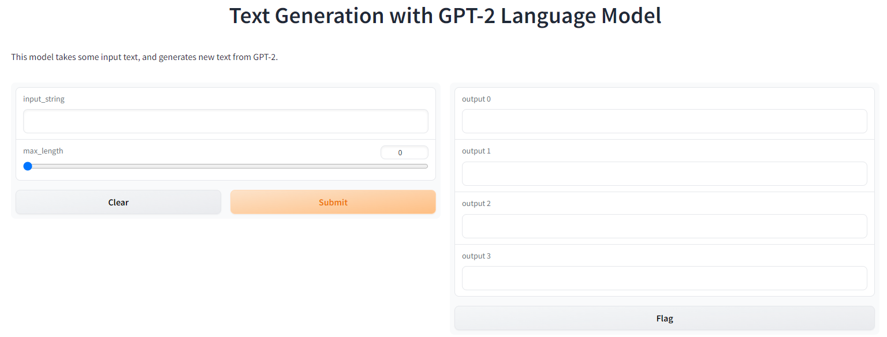

# Complete the UI

**The first thing we will want to do is turn our text generation into a function.**
This makes it easy to integrate with our Gradio interface, and is best practice anyway. 


``` python
def text_gen(input_string, max_length):
  # defining our parameters
  top_p_params = {"max_length": max_length, "top_p": 0.95, "do_sample": True}
  top_k_params = {"max_length": max_length, "top_k": 4, "do_sample": True}
  contrastive_params = {
    "max_length": max_length,
    "penalty_alpha": 0.6,
    "top_k": 4
  }
  deterministic = inference(input_string)
  top_p = inference(input_string, top_p_params)
  top_k = inference(input_string, top_k_params)
  contrastive = inference(input_string, contrastive_params)

  return deterministic, top_p, top_k, contrastive
```


**Next we want to build our Gradio interface**. We know we have a text input and four text outputs, but let's also add a slider for our max length. There are some great examples in the [quickstart guide](https://gradio.app/quickstart/). 

```python
def to_gradio():

  demo = gr.Interface(
    fn=text_gen,
    inputs=["text", gr.Slider(0, 250)],
    outputs=["text", "text", "text", "text"],
    title="Text Generation with GPT-2 Language Model",
    description=
    "This model takes some input text, and generates new text from GPT-2.")
  demo.launch(debug=True, share=True)
  ```

  Since our text_gen function takes in two inputs and returns four outputs, it's that easy to integrate them!
  Now all we need to do is add a main function to run it all when we run the Repl..
```python
if __name__ == "__main__":
  to_gradio()
```


Looking great! Try some new inputs. **How does this compare with testing our tools before there was an interface?**

One feature we could add quickly is adding the ability to speak out our response with Text-to-Speech with one additional "audio" output in Gradio and [gTTS (Google Text to Speech)](https://github.com/pndurette/gTTS). gTTS is a Python library and CLI tool to use Google Translate's text-to-speech API.

**Go ahead and try and implement this on your own.**